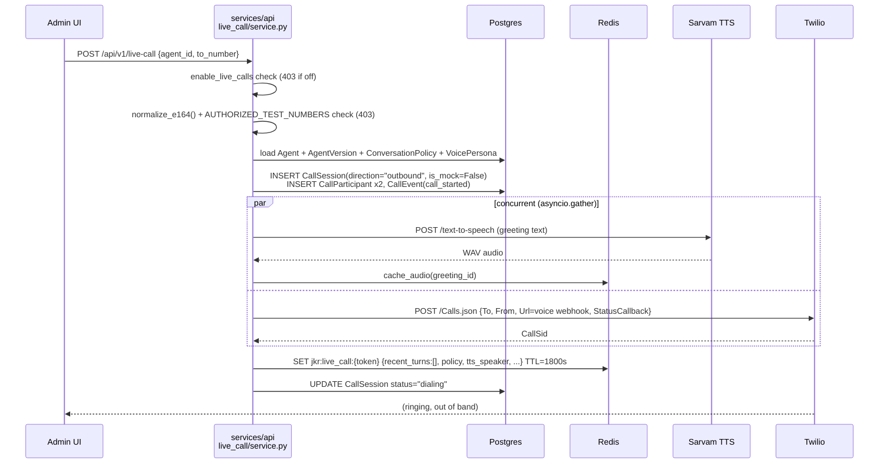
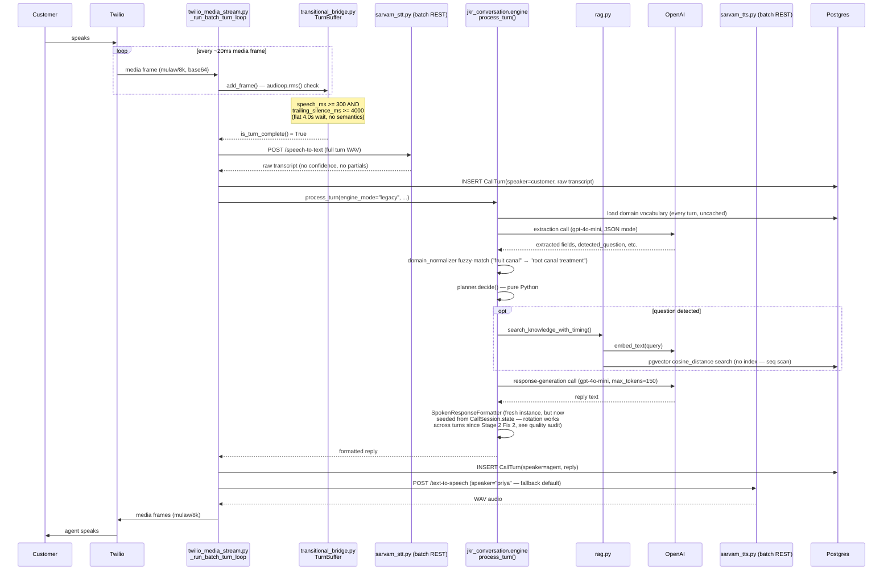
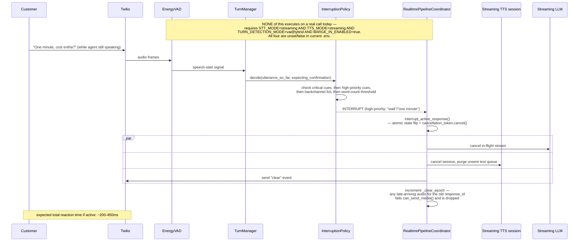
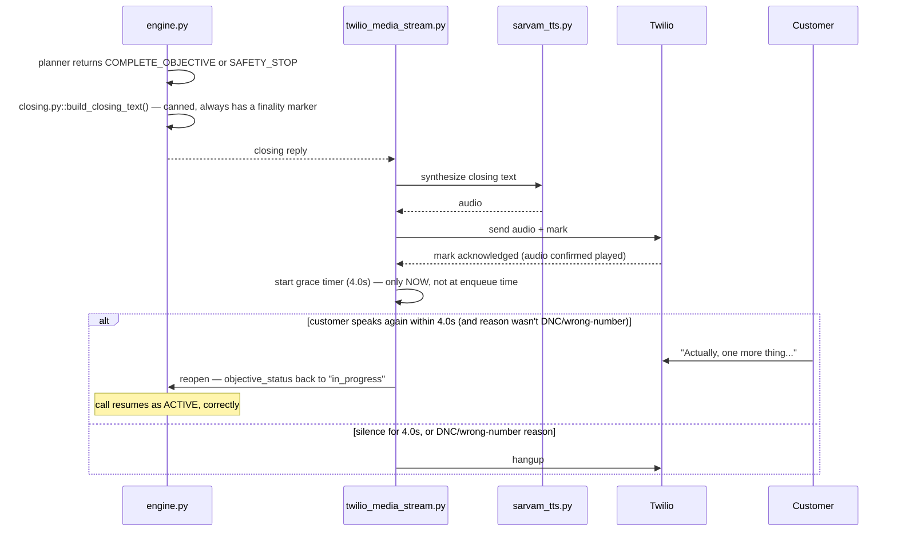

# JKR Real-Call Sequence — What Exactly Happens During One Real Call

This document describes the **currently active** code path only (batch STT, batch TTS, legacy conversation engine, no barge-in — see [`JKR_RUNTIME_CONFIG_MATRIX.md`](./JKR_RUNTIME_CONFIG_MATRIX.md) for why). Diagram D (barge-in) is explicitly the *dormant/designed* path, clearly labeled as such, since it never executes today but is worth understanding for when it's activated.

**[Stage 2 update]** Diagram B's acknowledgement-rotation note below is now stale — see the inline correction and `docs/STAGE2_REAL_CALL_FIXES.md` Fix 1–3 for what changed. Everything else in this document (batch STT/TTS, 4.0s TurnBuffer, sequential pipeline, dormant barge-in) is unchanged and still accurate.

---

## Layer A — Non-technical (for a product manager)

**Scenario**: Aaha Dental Care's AI agent calls Ravi, a patient, in Telugu-English (`te-en-IN`).

1. Someone clicks "Live Test Call" in the admin UI and picks Ravi's number. The system checks that number is on an approved allow-list (a hard safety gate — only pre-authorized numbers can ever be dialed this way), then asks Twilio to place the call and simultaneously starts preparing the greeting audio.
2. Ravi's phone rings. He answers. Twilio connects a live audio channel back to JKR's server.
3. The greeting plays: a short self-introduction that explicitly says "I'm an AI assistant," then asks if he has a minute. Ravi cannot interrupt this greeting even by talking over it — the system doesn't listen for that yet.
4. Ravi says "Root canal గురించి enquiry ఇచ్చాను" (I made an enquiry about a root canal). The system waits until he's been silent for **a full 4 seconds** before it assumes he's finished talking — this is currently a flat timer, not a smart "did they actually finish their thought" check.
5. His speech is sent off to a transcription service, then to a language-understanding step that pulls out what he's asking about, then — if a factual question was detected — to a knowledge-base lookup, then to a response-writing step. All of this happens sequentially, each step waiting for the previous one, before anything is said back to him.
6. The reply is spoken back using a text-to-speech voice. Right now this is a generic default voice, not one specifically chosen for this business, because the per-agent voice was never actually configured.
7. Ravi asks "Cost entha?" (What's the cost?) mid-conversation. Same sequence repeats: 4-second wait, transcribe, understand, look up pricing in the FAQ, respond.
8. Ravi tries to interrupt with "One minute, Sunday open aa?" while the agent is still mid-sentence about pricing. **Today, this interruption is silently ignored** — the agent keeps talking over him until it finishes its planned sentence, then processes his next turn normally afterward. This is one of the most noticeable gaps between what the system is built to do and what it actually does on a call today.
9. Once the appointment objective is satisfied, the agent delivers a closing line and waits 4 seconds to see if Ravi says anything else before actually hanging up. If he speaks again in that window, the call correctly resumes instead of hanging up on him.
10. After the call ends, a background process re-validates what was extracted, classifies the outcome, writes a summary, and (if applicable) sends a WhatsApp follow-up — none of this happens live, all of it after hangup.

**The one thing worth knowing above everything else**: the system was built with a much more sophisticated real-time architecture (live interruption handling, streaming responses, smarter pause detection) — that code exists and is tested, but a configuration setting that would turn it on was never flipped. The call described above is running the simpler, older behavior underneath a newer transport wrapper.

---

## Layer B — Engineering detail

### Diagram A — Call setup

### Diagram B — Normal turn (active path: batch STT, batch TTS, legacy engine)

### Diagram C — RAG-answering turn

Same as Diagram B's "question detected" branch, expanded: `rewritten_query` from the extraction call must be non-null (it isn't schema-enforced to agree with `detected_question`); if it's null, RAG is silently skipped and the question goes unanswered even though the customer clearly asked something.

### Diagram D — Barge-in (AS DESIGNED — this path is currently DORMANT, see config matrix)

### Diagram E — Closing

### What the customer has actually heard — the state the coordinator tracks (when active)

Five distinct, never-collapsed values: `text_generated` (full LLM output) → `text_committed_to_tts` (handed to TTS) → `audio_ms_generated` (TTS produced) → `audio_ms_sent` (enqueued to Twilio) → `audio_ms_acknowledged` (Twilio confirmed via `mark`). The one honest "what did they hear" answer is `_conservative_delivered_text()`: every chunk logged at or before the last **acknowledged** playback unit's timestamp — anything submitted after that point is excluded even if bytes reached the TTS provider, because there's no positive evidence it played.
